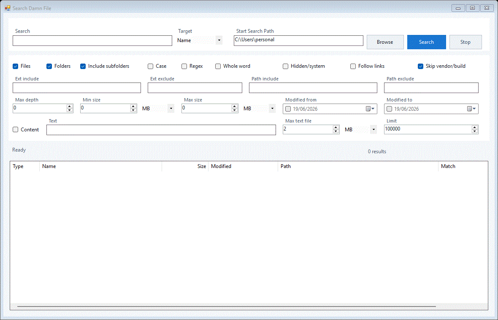
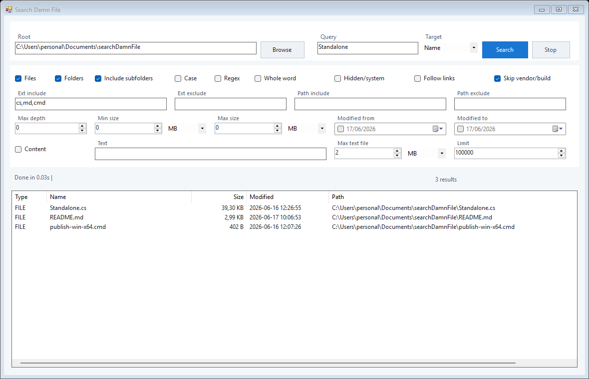

# Search Damn File

Search Damn File is a small Windows desktop file finder built with plain C# WinForms.
It is designed to be fast, portable, and easy to build from source: no NuGet packages,
no installer, and no SDK-style project file required.

## Demo



## Screenshot



## Features

- Native WinForms desktop UI.
- Background search with cancellation.
- Search by file name or full path.
- File and folder results.
- Optional regex, case-sensitive, and whole-word matching.
- Include or exclude hidden/system items and reparse points.
- Skip common vendor/build directories such as `.git`, `node_modules`, `bin`, `obj`,
  `dist`, and `build`.
- Include/exclude filters for extensions and paths.
- Size, modified date, max depth, and result limit filters.
- Optional text-content search with a per-file size limit.
- Virtualized result list for large result sets.
- Double-click to open a file or folder.
- Context menu actions: open, open containing folder, copy path, copy name.
- Drag and drop results to other apps using the native `FileDrop` format.

## Requirements

- Windows
- .NET Framework compiler at:

```text
%WINDIR%\Microsoft.NET\Framework64\v4.0.30319\csc.exe
```

This compiler is included with many Windows/.NET Framework installations. If the
build script cannot find it, install or enable .NET Framework 4.x developer tools.

## Build

From the repository root:

```cmd
publish-win-x64.cmd
```

The executable is written to:

```text
publish\SearchDamnFile.exe
```

## Run

After building, launch:

```cmd
publish\SearchDamnFile.exe
```

## Usage Notes

- Press `Enter` in the query field to start a search.
- Set `Max depth` to `0` to search only the selected root folder.
- Extension filters accept comma-separated values such as `cs,txt,md`.
- Path filters accept comma-separated text fragments matched against the full path.
- Content search reads text files up to the configured `Max text file` size.
- Files and directories that cannot be accessed are skipped and counted as errors in
  the status bar.

## Project Layout

```text
Standalone.cs           Main application source code
publish-win-x64.cmd     Windows x64 build script
tools/                  Maintainer utilities
docs/assets/            README screenshots and demo GIF
publish/                Local build output, ignored by Git
```

## Maintainer Notes

Regenerate README screenshots and the demo GIF with:

```cmd
tools\capture-assets.cmd
```

Create a release by pushing a version tag:

```cmd
git tag v0.1.0
git push origin v0.1.0
```

The release workflow builds `SearchDamnFile.exe`, packages it as a zip file, and
publishes it on the GitHub release.

## Contributing

Issues and pull requests are welcome. Please read [CONTRIBUTING.md](CONTRIBUTING.md)
before proposing changes.

## Security

Please see [SECURITY.md](SECURITY.md) for vulnerability reporting guidance.

## License

This project is released under the [MIT License](LICENSE).
